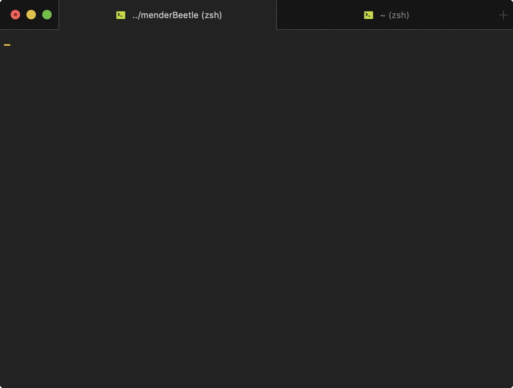

# mender-beetle
[](http://www.wtfpl.net/about/)

Mend your broken and ugly and stupid JSON structure, and you feel better :)


### Requirements
- A working PC / laptop with Unix or Unix-like environment (fck windows)
- NodeJS version 8 or later
- Relatively healthy and sane human brain


### How To Setup
```bash
git clone https://github.com/td0/mender-beetle.git

cd mender-beetle

npm i
```


### How To Use


- (OPTIONAL) make an object-worker script and save it in `/objectWorkers` directory (just take alook at the existing sample) don't omit the `.js` extension!! (Do whatever the fck u want with your JSON there)
- (ALSO OPTIONAL) put your source JSON file that u want to mend inside `/json` directory, and put `.json` extension there so the app can find the file automatically (no you can't set the source by typing it manually, follow the rules John!)
- run `./menderBeetle`
- pick your source JSON file -**OR**- choose `Load from URL` if you want to load the JSON from remote URL
- pick a worker (the app will automagically list all object-worker files inside the `/objectWorkers` directory)
- press `n` if u don't wanna minify the JSON output, **OR** simply press enter
- if you picked a correct worker, it will generate the output file in `/output-json` directory with the same name as the source JSON
- EN-fcking-JOY!!
